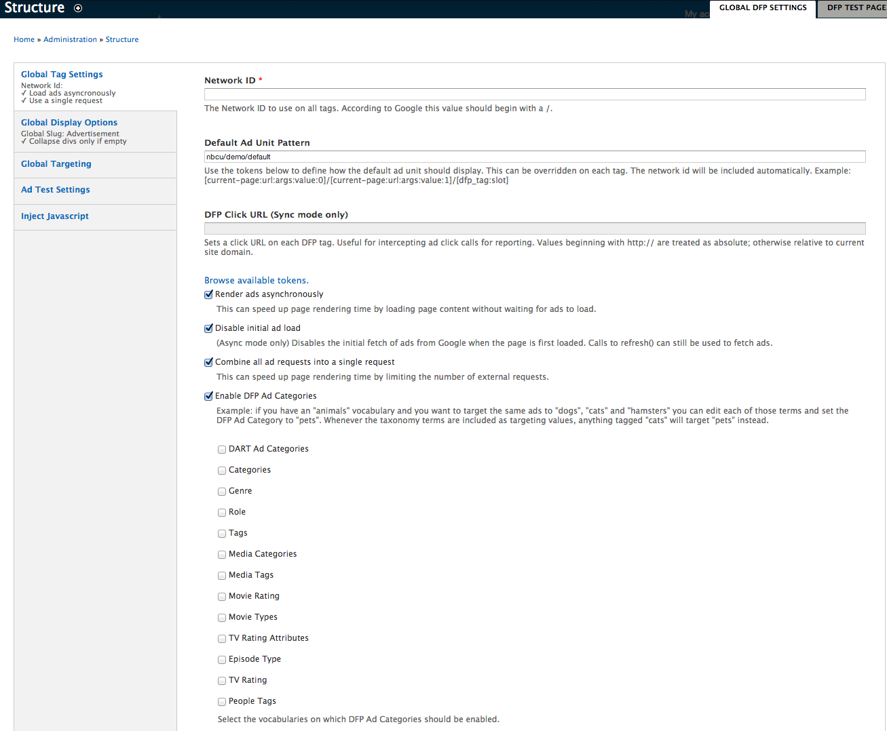
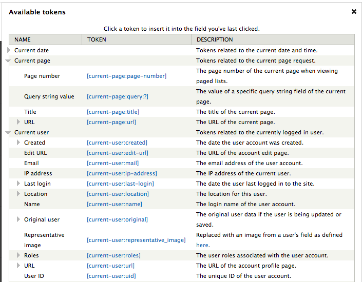
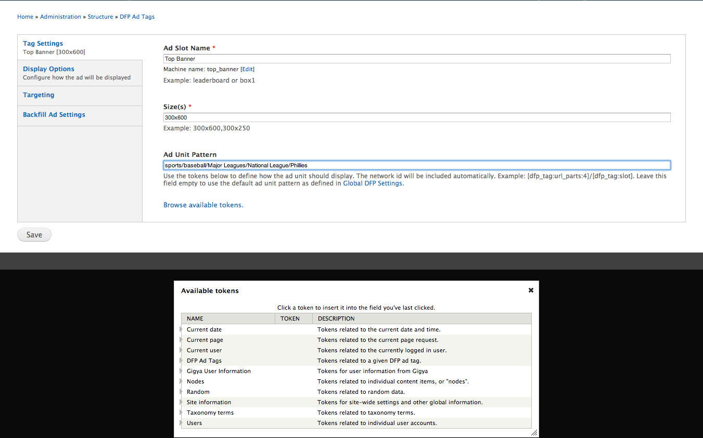
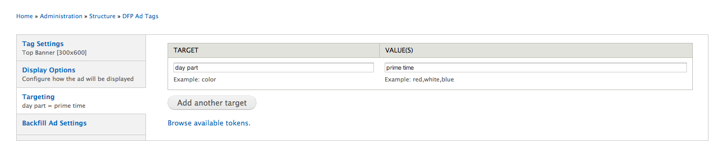

DFP Module Ad Tagging (GPT)
=================================

The [DFP](http://www.google.com) DFP Module is very similar to the DART Module but uses more JavaScript and is more developer friendly. 

To activate the DFP module: 

1. Click the **Modules** menu.  

  The **Module** page appears.  

2. From the left pane, click **Advertising**.  

  A list of advertising modules appears. 

3. Check the **Double Click for Publishers** box.  

4. Click the **Save Configuration** button at the bottom of the left pane.  

Open the DFP Module
---------------
To open the DFP Module: 

1. From the **Structure** menu, select **DFP Ad Tags**, **Global DFP Settings**.  

    The DFP Module appears with three tabs: 

  - **Global DFP Settings**

  - **DFP Test Settings**

  - **List**

  The **Global DFP Settings** tab is open by default.  

Enter Global DFP Settings
---------------

The Global Enter Global DFP Settings contains six sections:

 - **Global Tag Settings** 

 - **Global Display Options**

 - **Global Targeting**

 - **Ad Test Settings**

 - **Inject Javascript**

Enter Global Tag Settings 
---------------

To enter Global Tag Settings: 

1.  In the **Network ID** field, enter the **ID** provided by Ad Ops or Google. 

2.  In the **Default Ad Unit Pattern**, enter up to five levels of hierarchy the site will use when no other hierarchy is found.  

  Typically [tokens](#IncludeTokens) are used. 

  _**Note: The DFP Click URLs field helps provide analytics for advertising clients.  However, NBC does not use it. **_

3.  Check the **Render Ads Asynchronously** box to load page content without waiting for ads to load.

4. Check the **Disable initial load** box to stop the initial retrieval of ads from Google when the page first loads.  

  This setting can be useful if you want an ad to display only when a user takes action on the page, such as clicking Next in a photo gallery.  

5.  Check the **Combine all ad requests into a single request** box to speed your page load.  

6.  Check the Enable **DFP Ad Categories** box to have ad categories entered by others to be redirected to Ad Categories that you have set and check the boxes for the categories you want to use.  

  _**Note: You may receive editorial requests that do not correspond to the categories of ads being sold.  For example, an editorial request might ask for the color *red*, when a category called *warm colors* is actually for sale.  Enable **DFP Ad Categories** to redirect requests to the appropriate category. **_

Enter Global Display Options
---------------

To enter Global Display Options: 

1.  On the left pane, click **Global Display Options**.  

2.  In the **Global Slug** field, enter the text required to appear above your ad, such as **Advertisement**.  

  _**Note: To leave the slug blank, enter <none>.**_
 
3.  In the **Collapse empty divs** section, click the appropriate radio button to specify what the site should do when no ad is loaded in a block:

<table>
    <tr>
        <td>**To**: </td>
    <td>**Click**:</td>
    </tr>
    <tr>
        <td>Leave a blank block</td>
    <td> **Never** </td>
    </tr>
    <tr>
        <td> Have blocks expanded by default </td>
    <td> **Collapse only if no ad is served** </td>
    </tr>
    </tr>
    <tr>
        <td> Have blocks collapsed by default </td>
    <td> **Expand only if an ad is served** </td>
    </tr>
</table>

4. Check the **Hide slug if no ad is served (recommended)** box to leave the slug blank for any ad that does not load.  

Enter Global Targeting 
---------------

To enter Global Targeting: 

1.  On the left pane, click **Global Targeting**.  

2.  In the **Key** field, enter a category such as **color**.  

3.  In the **Value** field, enter a member of that category, such as **green**.  

<a name="IncludeTokens">Include Tokens </a>
---------------

To add tokens: 

1. Place your cursor in the field to which you want to add tokens.  

2. Click the **Browse Available Tokens** link.  

  A list of available token types appears.  

3.  Click the arrow next to the required token type.  

  A list of token hyperlinks appears. 

4. Click on the token hyperlink.  

  The token appears in the field in which you last placed your cursor. 

  You can enter whatever key and whatever value you want.   

  The key | value pair appears in the html code of your site.  

  _**Note: The key | value pairs appear in the html code of your site as a <script type src= setting, separated by semicolons. **_

Enter Ad Test Settings 
---------------

To enter Ad Test Settings: 

1.  On the left pane, click **Ad Test Settings**.  

  The Ad Test Settings section appears. 

  You can use the settings in this section to create a test page in which all of the ads for a particular campaign are trafficked to a test page that the client can view.  When you enter the **?adtest=true query** string to any url of your site, the new prefix, site, and zone you specify on this page replaces the prefix, site, and zone of your URL to create this test page.  

To view this page, add **?adtest=true query** to the URL in your browser.  

You can also add [tokens](#IncludeTokens). 

Inject Javascript 
---------------

To inject Javascript: 

1.  On the left pane, click **Inject JavaScript**.  

  The **Inject JavaScript** screen appears.  

2. In the **Inject JavaScript** field, enter any JavaScript that the page needs to work. 

3. Click the **Save configuration** button. 

Complete the List Tab
---------------

The **List** tab enables you to enter settings for individual ad tags.  It appears with the following sections: 

  -**Tag Settings**

  - **Display Options**

  - **Targeting Ad**

  - **Backfill Ad Settings**

To enter Tag Settings: 

1.  Click **List**.  

  The **List** tab appears.  

2. Click the **Add** link.  

  The **Tag settings** screen appears.  

3. In the **Ad Slot Name** field, enter a human-readable name, such as **Top Banner**.

4. In the **Sizes** field, enter the dimensions of your ad, such as **300x600**. 

5. In the **Ad Unit Pattern** field, enter five levels of content hierarchy for this individual ad slot, separated by slashes, such as: **sports/baseball/Major Leagues/National League/Phillies**.

  *You can also add [tokens](#IncludeTokens).*

Enter Display Options
---------------

To enter Display Options: 

1. On the left pane, click **Display Options**.  

2.  In the **Slug** field, enter the text required to appear above your ad, such as **Advertisement**.  

  _**Note: To leave the slug blank, enter <none>.**_

3.  Check the **Create a block for this ad tag** box to create a structured block.  

  This creates a Drupal block that makes it easy to place an ad tag in the correct place.  The block appears on your list of **Blocks** page (**Structure=>Block**.)

4.  Check the **Render this tag without JavaScript** box if the ad is to appear in email only. 

Enter Targeting 
---------------

To enter Global Targeting: 

1.  On the left pane, click **Global Targeting**.  

2.  In the **Key** field, enter a category such as **day part**.  

3.  In the **Value** field, enter a member of that category, such as **prime time**.  

_**You can also add [tokens](#IncludeTokens).**_

You can enter whatever key and whatever value you want.   

The key | value pair appears in the html code of your site.  

Backfill Ad Settings
---------------

If your ad inventory runs out and you need to fill ad space for a time, you can use Adsense to generate relevant ads for your pages.   

To use Adsense ads: 

1.  From the **Adsense Ad Type** dropdown select: **Both image and text ads**, **Only image ads**, **Only text ads**
1. Click the **Save** button.  

**Note**: You can use the Exportable Scheduler Module to schedule when an ad tag shows up if there is no ad available.   This enables you to avoid charges from Google for having ad tags on your page.

To enable the Exportable Scheduler Module:

1.  Click the Modules menu. 
1.  Click Advertising. 
1.  Check the Exportable Scheduler Modle box. 
1.  Click the Save configuration button. **_ 

